# U.S. Stock Time Series Analysis

## Introduction

This project analyzes daily log returns for U.S. stocks using data from Finnhub and Yahoo Finance APIs. The objective was to create a nuanced view of the U.S. stock market by examining both trading days with active price movements and days without changes (resulting in zero log returns). These zero log returns stem from stocks with low trading volumes or market inactivity, especially for stocks with infrequent trading patterns. Including both active and inactive days allows for a holistic perspective on market stability and stock behavior across activity levels.

### Data Preprocessing Steps

To manage the large dataset and extract relevant insights, I implemented:

1. **Symbol Sampling**: Random sampling of stocks to ensure diverse market representation across trading frequencies and activity levels.
2. **Inclusion of Zero Returns**: Kept zero returns to capture market behavior in lower-trading stocks and focused separately on active trading periods by excluding zero returns.
3. **Batch Processing**: Processed data in batches to improve handling and performance.

---

## Aggregate Analysis

### Figure 1: Distribution of Mean Log Returns Across All Stocks
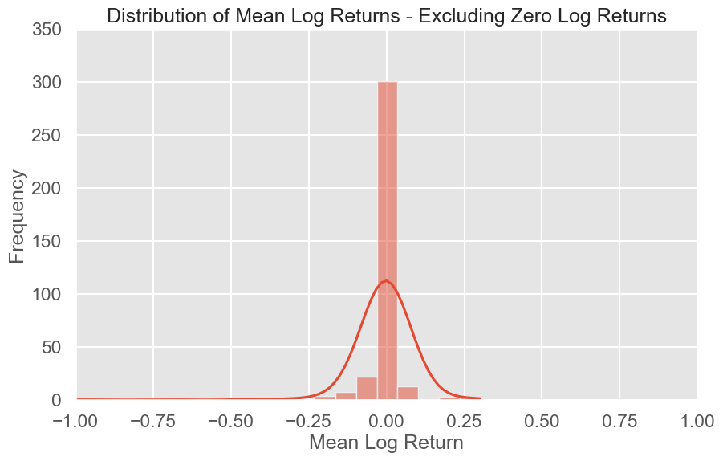  
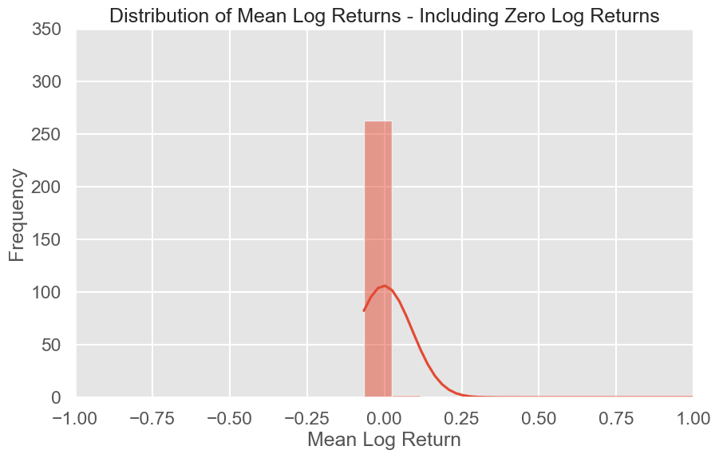

**Objective**: To capture the general performance of stocks, this analysis plots the distribution of mean log returns for each stock, providing insight into market trends.

#### Methodology
1. **Mean Log Return Calculation**: Calculated average daily log returns for each stock to represent typical returns over the observed period.
2. **Separate Views with Zero Returns**:
   - *Including Zero Log Returns*: Reflects all trading days, representing stocks with low and high trading volumes.
   - *Excluding Zero Log Returns*: Focuses on actively traded stocks, omitting inactive periods for more dynamic stock performance insights.

#### Key Observations
- **Centering Around Zero**: Most stocks cluster around a mean return of zero in both versions, indicating overall market neutrality and balanced performance.
- **Broadened Distribution Without Zero Returns**: Excluding zero returns slightly broadens the distribution, showing more variation in returns among actively traded stocks.
  
---

### Figure 2: Volatility (Standard Deviation of Log Returns) Across Stocks
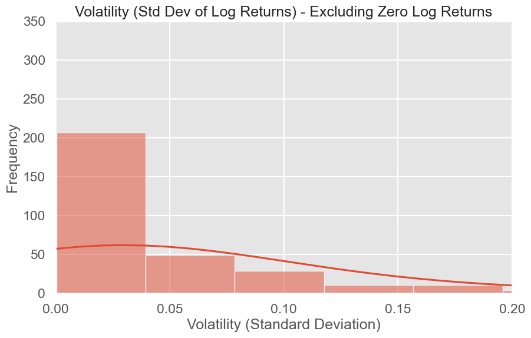  
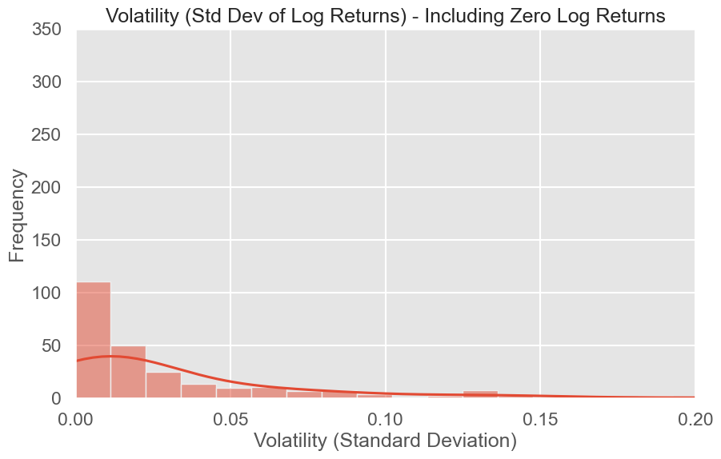

**Objective**: This plot evaluates the volatility of each stock’s returns, showing how much individual stocks fluctuate over time.

#### Methodology:
1. **Volatility Calculation**: Calculated the standard deviation of log returns for each stock symbol.
2. **Separate Analyses for Different Perspectives**:
   - *Including Zero Log Returns*: This approach captures periods where stocks exhibit no price change, often due to low trading volume.
   - *Excluding Zero Log Returns*: This method focuses solely on active trading days, emphasizing the volatility when price movement does occur.

#### Key Observations and Insights:
- **Effect of Zero Returns on Volatility**:
   Including zero returns skews results towards low volatility, representing the many low-activity stocks, particularly low-volume penny stocks. These stocks often have long stretches of zero returns, resulting in a lower calculated standard deviation due to the repeated zero values, which mask potential fluctuations.
  
- **Impact of Excluding Zero Returns**:
   When zero returns are excluded, we observe a wider range of volatility. This effect reveals the true volatility of penny stocks and other lower-volume assets on their active trading days. Since we focus only on days with price movement, the results capture the characteristic price swings associated with penny stocks when they do trade, aligning with the known high volatility of these assets.

#### Market Composition:
This analysis highlights two perspectives:
   - *Including Zero Returns* provides a conservative measure of market volatility by representing stability in low-activity stocks.
   - *Excluding Zero Returns* offers insight into the fluctuations experienced by stocks, especially penny stocks, during active trading periods. This focus is beneficial for understanding the behavior of volatile stocks on days with actual price movements.

---

### Figure 3: Min vs. Max Log Returns for Each Stock
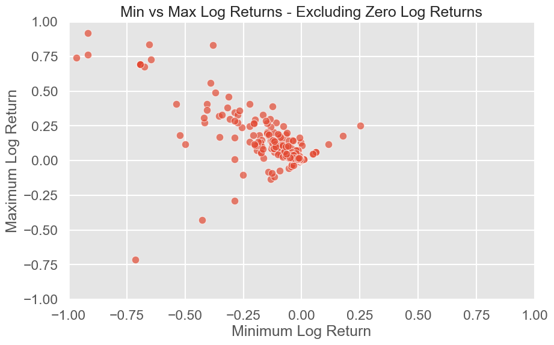  
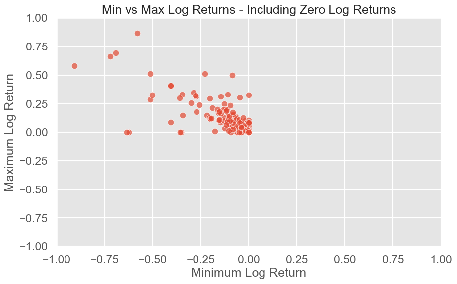

**Objective**: This scatter plot shows the minimum and maximum log returns for each stock, representing their performance range.

#### Methodology
1. **Extreme Return Calculation**: For each stock, recorded the minimum and maximum daily log returns to capture the range of price movement.
2. **Separate Views for Range Comparison**:
   - *Including Zero Log Returns*: Shows a stable market with stocks staying within a narrow range.
   - *Excluding Zero Log Returns*: Highlights volatility in active stocks with wider price swings.

#### Key Observations
- **Stock Stability**: Most stocks remain within a narrow range in both views, though active trading periods reveal larger fluctuations.
- **Extreme Movements**: Excluding zero returns showcases stocks that can experience more significant highs and lows, useful for identifying stocks with high-risk, high-reward profiles.

---

### Figure 4: Mean Log Return vs. Volatility (Standard Deviation of Log Return)
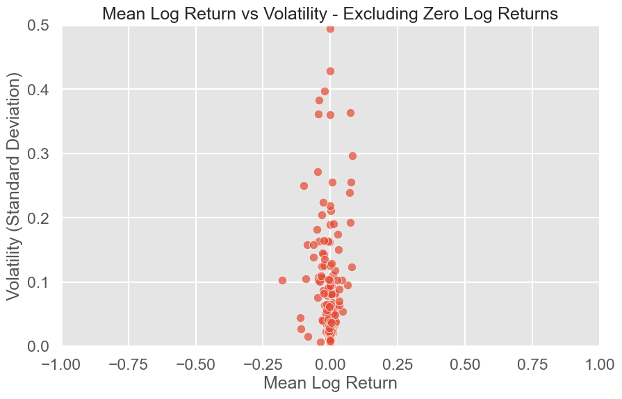  
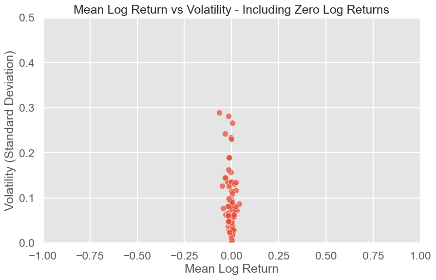

**Objective**: This scatter plot visualizes the risk-return relationship by comparing mean return and volatility for each stock.

#### Methodology
1. **Risk-Return Calculation**: Calculated the mean log return and volatility for each stock.
2. **Separate Views for Different Risk Profiles**:
   - *Including Zero Log Returns*: Captures lower-risk, lower-return stocks.
   - *Excluding Zero Log Returns*: Emphasizes riskier stocks with higher return potential.

#### Key Observations
- **Concentration in Low Risk-Return**: Stocks generally cluster at low return and low volatility in both views, though active stocks naturally show higher volatility.
- **Risk-Return Tradeoff**: Actively traded stocks display a broader risk-return spread, reinforcing the principle of potential higher returns with increased risk.

---

### Figure 5: Correlation Matrix of Summary Statistics
  
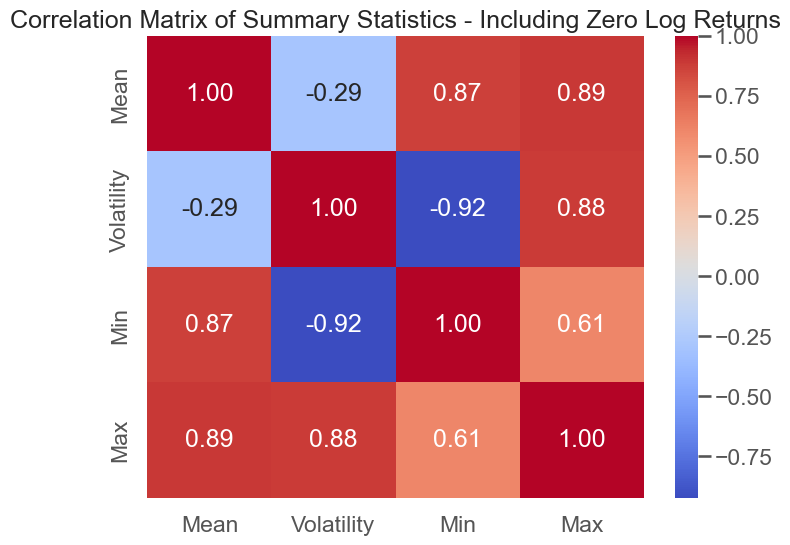

**Objective**: The correlation matrix shows the relationships between statistical measures (mean, volatility, min, max) for each stock.

#### Methodology
1. **Correlation Analysis**: Calculated correlations between statistics to explore interdependencies.
2. **Separate Market Views**:
   - *Including Zero Log Returns*: Emphasizes low-activity stocks’ stability.
   - *Excluding Zero Log Returns*: Shows interrelationships in active stocks.

#### Key Observations
- **Strong Min-Max Correlation**: Volatile stocks display extreme values in both directions.
- **Higher Correlation in Active Stocks**: Excluding zero returns increases correlations, underscoring the relationship between volatility and extremes.

---

### Figure 6: Autocorrelation Analysis (30-Day Lag)
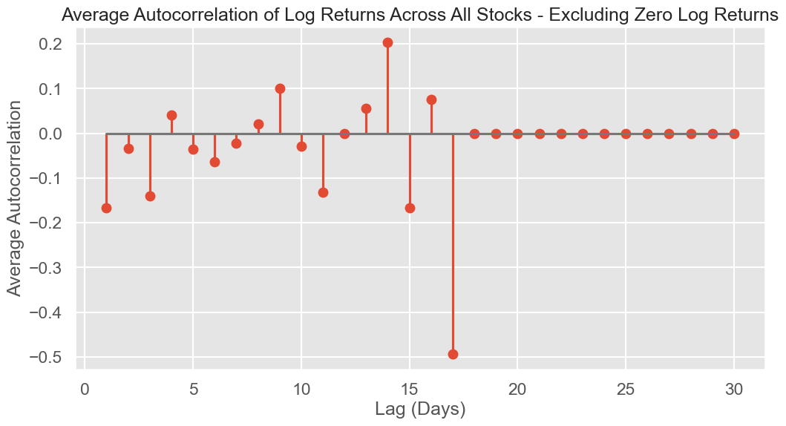  
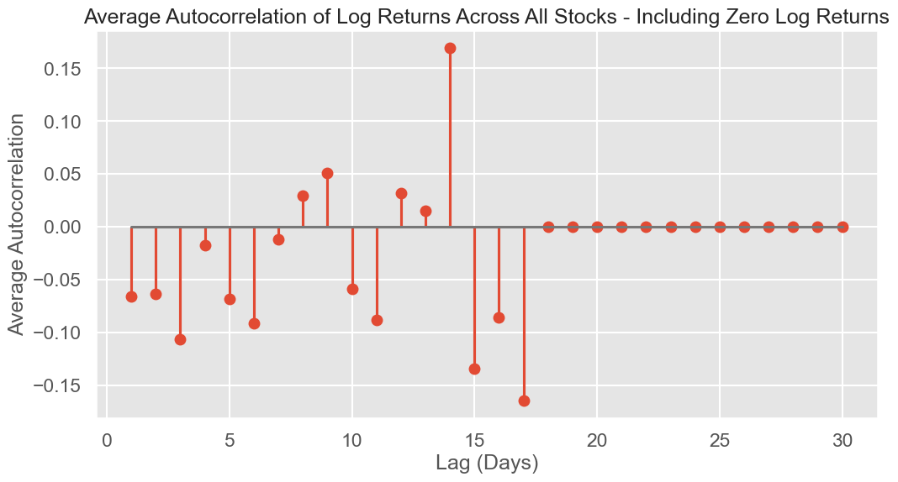

**Objective**: This analysis examines the average autocorrelation of daily log returns across stocks over a 30-day lag period. Autocorrelation indicates the extent to which past returns influence future returns, which can reveal persistence or mean-reverting tendencies in stock behavior.

#### Methodology:
1. **Autocorrelation Calculation**: For each stock, the autocorrelation of daily log returns was calculated over lags from 1 to 30 days.
2. **Separate Analyses for Market Dynamics**:
   - *Including Zero Log Returns*: This view includes stocks with periods of inactivity, giving insight into the overall market.
   - *Excluding Zero Log Returns*: Focuses on stocks during active trading periods, reducing the impact of inactivity.

#### Key Observations and Insights:
- **Slight Negative Autocorrelation in Lower Lags**: In the initial few lags, there is a slight negative autocorrelation. This could suggest a mild mean-reverting behavior in the short term, where negative returns are somewhat likely to be followed by positive returns and vice versa. Such behavior may reflect short-term trading patterns or the impact of rapid corrections in stock prices.

- **Peak Positive Autocorrelation at 14-Day Lag**: Around the 14-day lag, there is a noticeable peak in positive autocorrelation. This could imply a bi-weekly pattern in stock behavior, potentially influenced by market cycles or recurring investor behavior that aligns with a two-week period. This pattern might reflect regular trading or investment schedules, such as bi-weekly reporting or settlement periods, or could be due to market participants adjusting positions every two weeks.

- **Significant Negative Autocorrelation at 17-Day Lag**: A pronounced drop in autocorrelation around the 17-day lag appears in both versions of the plot. This sharp decline might indicate a market response to mid-month events or settlements, where earlier patterns are offset. For example, this could be due to institutional rebalancing or other periodic adjustments, causing a reversal in price movements around this time frame.

#### Insights:
- **Market Cyclicality and Short-Term Mean Reversion**: The presence of both negative and positive autocorrelation peaks at specific lags suggests that the U.S. stock market may experience short-term cycles or mean-reverting tendencies, particularly in active stocks.
- **Implications for Trading**: Traders could potentially leverage these short-term correlations by observing patterns within the first few lags.

---

### Figure 7: Day-of-Week Effect on Log Returns
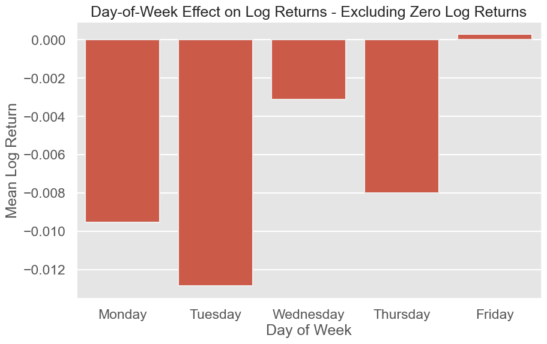  
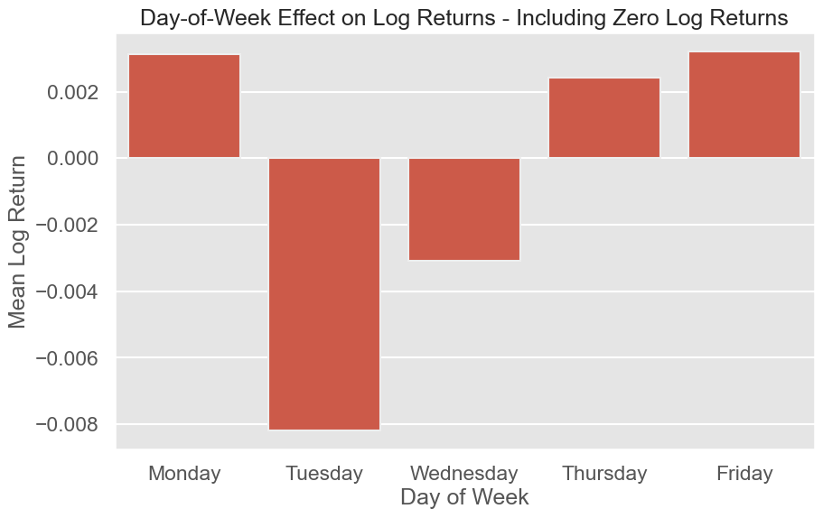

**Objective**: This plot examines if returns vary by day of the week, uncovering potential behavioral trading patterns.

#### Methodology
1. **Daily Average Calculation**: Calculated the mean log return for each weekday.
2. **Separate Views for Pattern Identification**:
   - *Including Zero Log Returns*: Captures overall market behavior.
   - *Excluding Zero Log Returns*: Highlights patterns in active stocks.

#### Key Observations
- **Day-of-Week Anomalies**: Patterns, though limited in significance due to sample size, suggest minor behavioral effects, like mid-week optimism or end-of-week caution.

---

### Figure 8: 30-Day Average Rolling Mean and Volatility Across All Stocks
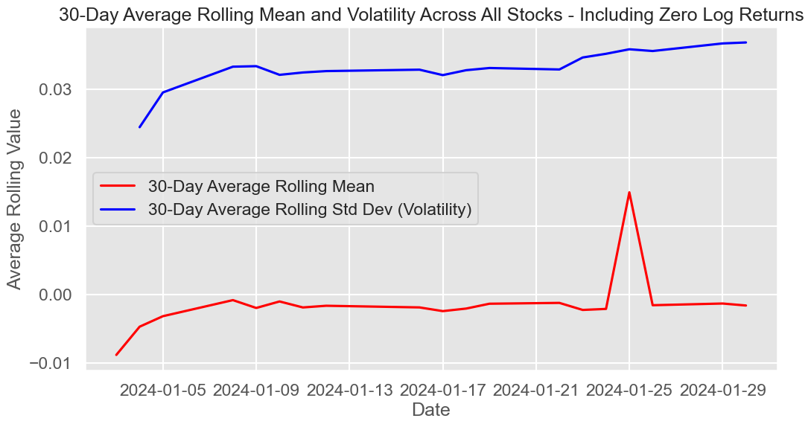  
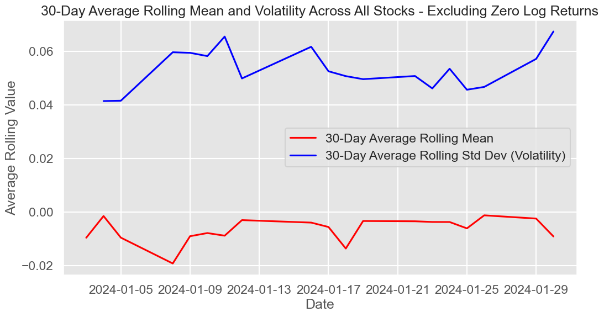

**Objective**: This figure tracks the 30-day rolling mean and volatility, capturing trends in returns and fluctuations.

#### Methodology
1. **Rolling Calculation**: Computed a 30-day rolling mean and volatility for each stock.
2. **Separate Views for Market Trends**:
   - *Including Zero Log Returns*: Reflects market stability.
   - *Excluding Zero Log Returns*: Shows higher variability in active stocks.

#### Key Observations
- **Volatility Clustering**: Periods of heightened volatility often follow high trading volumes, suggesting momentum patterns that traders can leverage.

---

## Conclusion

This project provides insights into the U.S. stock market by analyzing daily log returns, capturing patterns across active and inactive periods. Including zero returns offers a broader market perspective, essential for understanding general stability and the impact of lower trading volumes. Conversely, excluding zero returns emphasizes trends within active stocks, highlighting volatility and risk-return dynamics. While this dataset is a subset of U.S. stocks, the approach offers valuable insights for investment strategies by combining broader market trends with detailed, activity-driven stock behavior.
