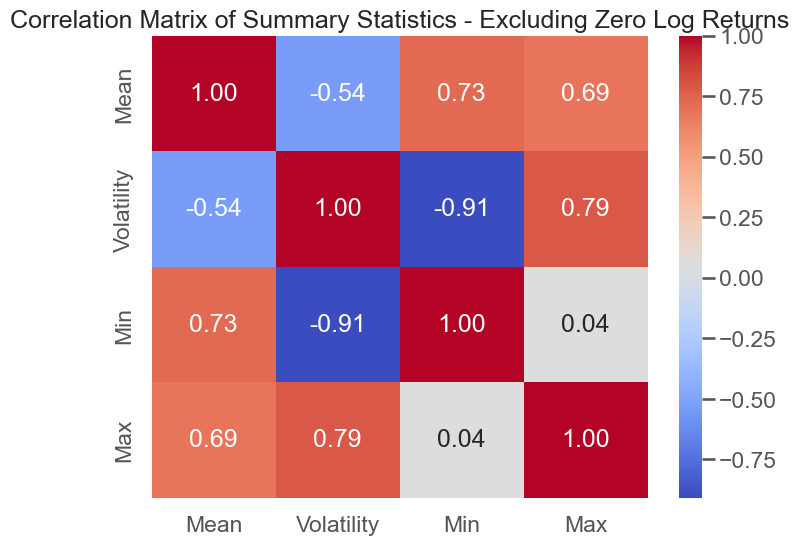

# U.S. Stock Data Analysis

## Introduction

This project provides a comprehensive analysis of U.S. stock data using daily log returns, examining various statistical properties and patterns across different stocks. Through an investigation of mean log returns, volatility, autocorrelation, and other metrics, we aim to uncover insights into market behavior, focusing both on stocks with regular trading volume and less active markets.

## Data Preprocessing

Data preprocessing involved filtering and sampling data by stock symbols, with two separate analyses: one that included zero log returns (capturing inactive trading days) and one that excluded them (highlighting active trading days). This dual approach allowed for a holistic view of market activity and a focused analysis of stocks with consistent trading activity.

## Analysis

### Figure 1: Distribution of Mean Log Returns Across All Stocks
#### Including Zero Log Returns

#### Excluding Zero Log Returns

This figure shows the distribution of average returns across all stocks, illustrating the central tendency of most stocks to have mean returns close to zero.

### Figure 2: Volatility (Standard Deviation of Log Returns) Across Stocks
#### Including Zero Log Returns

#### Excluding Zero Log Returns

The volatility plot shows that most stocks experience low to moderate levels of volatility, with only a few stocks exhibiting higher volatility.

### Figure 3: Min vs. Max Log Returns for Each Stock
#### Including Zero Log Returns

#### Excluding Zero Log Returns

The scatter plot compares minimum and maximum log returns for each stock, highlighting the degree of variation and risk across individual stocks.

### Figure 4: Mean Log Return vs Volatility (Standard Deviation of Log Return)
#### Including Zero Log Returns

#### Excluding Zero Log Returns

This figure explores the relationship between mean returns and volatility, providing insights into the risk-return tradeoff across different stocks.

### Figure 5: Correlation Matrix of Summary Statistics
#### Including Zero Log Returns

#### Excluding Zero Log Returns

The correlation matrix provides a statistical summary of relationships between metrics such as mean, volatility, and min/max returns.

## Time Series Analysis

### Figure 6: Autocorrelation Analysis (30-Day Lag)
#### Including Zero Log Returns

#### Excluding Zero Log Returns

The autocorrelation analysis examines return persistence over a 30-day period, showing how the correlation of returns decreases over time.

### Figure 7: 30-Day Rolling Volatility Across All Stocks
#### Including Zero Log Returns

#### Excluding Zero Log Returns

The 30-day rolling volatility plot reflects changes in market conditions over time, highlighting periods of increased or decreased volatility.

### Figure 8: Day-of-Week Effect on Log Returns
#### Including Zero Log Returns

#### Excluding Zero Log Returns

This analysis explores whether certain days of the week exhibit consistent return patterns, revealing any potential day-of-week effect on returns.

## Conclusion

This analysis sheds light on the dynamics of U.S. stock returns and volatility, examining patterns across both inactive and actively traded stocks. By including and excluding zero log returns, we can see both the effects of stagnant trading periods and the behavior of more liquid stocks, providing a broad and insightful view into stock market performance.
